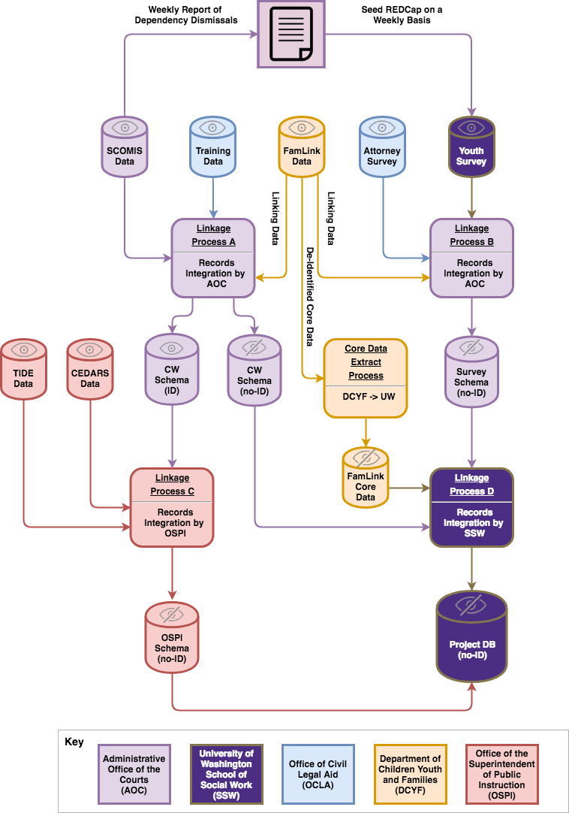

```{r setup, include=FALSE}
knitr::opts_chunk$set(echo = TRUE, fig.pos = 'H')
```

# Purpose and Conceptual Rationale

## Background and Significance 

For over half a century, juvenile *delinquency* courts in the United States (US) have recognized a child's right to due process within the juvenile justice system. Beginning with @InReGault, the US Supreme Court ruled that children within the juvenile justice system have many of the same rights as adults, including a right to counsel. Federal guidance related to children's due process rights within *dependency* proceedings is somewhat less clear. Although federal statute requires that states develop procedures for the appointment of a Guardian ad Litem (GAL) in dependency cases, there is no requirement that the GAL be an attorney (in many jurisdictions, this requirement is frequently met with a volunteer Court Appointed Special Advocate (CASA)). Furthermore, GALs are appointed to represent the *best interests* of the child as compared to delinquency cases where counsel typically represents the child's *stated interest* [(42 U.S.C. §5106a(b)(2)(A)(xiii))](http://uscode.house.gov/view.xhtml?req=(title:42%20section:5106a%20edition:prelim)). 

While best-interest representation may be desirable in some cases, such representation may tend to overshadow a child's personal interests. Recent survey results of dependent children in Washington State are consistent with this thinking. Specifically, @Levezu2018 found that 84% of dependent child respondents who had been assigned *both* a GAL and a stated-interest attorney also reported that their opinions had been shared in court. In cases where only a GAL had been assigned, 20% of the respondents reported having their opinions shared. 

In response to the national and local dialogue referenced above, in 2017, Washington enacted [2nd Engrossed Substitute Bill 5890](http://apps2.leg.wa.gov/billsummary?BillNumber=5890&Year=2017&BillNumber=5890&Year=2017). Among other things, this law appropriated funds...

> ...to the office of civil legal aid [OCLA]...for the office to provide legal representation for foster children in two counties at the initial shelter care hearing in dependency proceedings... 

In other words, the legislature required OCLA to pilot universal legal representation for dependent children in two counties. In addition to authorizing the pilot, the legislature also appropriated funds to support an evaluation of the pilot focused on the experiences of children who are represented as a result of the pilot, and those who are not. The law requires that the pilot specifically focus on 

> ...[t]he time to achieve permanency and permanency outcomes;...[e]ducational, social, or other relevant child welfare indicators as determined relevant by the center including, but not limited to, relevant child welfare indicators identified through consultation with foster children, youth, and other stakeholders involved in the research assessment. The assessment must also identify and project cost savings to the state, if any, as a result of providing legal representation for children at the shelter care hearing.

Thus, this project is an effort by the legislature to expand due process rights for dependent youth in Washington, while simultaneously quantifying the impact that such an expansion might have across multiple domains. 

\newpage
## Research Questions

Similar to the QIC-ChildRep intervention described by @Orlebeke2016, the underlying logic of the Dependent Child Legal Representation (DCLR) pilot is that dependent children lack trained and effective legal advocacy within the dependency system. As described below, the QIC-ChildRep pilot has previously assessed the efficacy of the type of standards-based legal representation involved in the DCLR pilot. In other words, this pilot is not focused on whether or not the type of legal representation provided in the pilot is preferable to another model of representation. Rather, the overarching research question under consideration in this study is whether or not the presence of DCLR is beneficial to dependent children, as compared to current systems of advocacy and representation in Washington. 

As outlined in Figures 1-3 below, the study will proceed by measuring two categories of dependent measures which exist in the theoretical model under consideration. These measures include process measures ($P$), and child outcomes ($O$). The logic of the DCLR pilot is that measures in both categories are impacted, directly or indirectly, by the assignment of a trained attorney ($T$). Thus, the two overarching research questions in this study are 

1. What effect does the provision of trained, standards-based attorneys to dependent youth have on the dependency processes?, and 

2. What effect does the provision of trained, standards-based attorneys to dependent youth have on child outcomes?

The specific process measures identified for inclusion in this study are as follows: 

* Trust in Attorney	Process
* Perceived Information Sharing	Process
* Perceived Voice in Court Hearings	Process

The specific outcome measures identified for inclusion in this study are as follows: 

* Suspension/Expulsion Rate
* Grade Point Average
* Truancy Rate
* Status Offense Rate
* 4th Grade Reading Proficiency Rate
* 12 Month Permanency Rate
* 24 Month Permanency Rate
* Continuity Rate
* Turnover Rate
* Student Flow
* Placement Move Rate
* Institutional Placement Rate
* Relative Placement Rate
* Hope Bed Placement Rate
* Runaway Rate
* Average Runaway Days
* Medical Home Rate
* Early-Intervention Service Rate
* Child Reported Parent Visit Rate
* Child Reported Sibling Visit Rate
* Child Reported Timing of First Visit
* Child Reported Visit Frequency

## Literature

There is a paucity of peer-reviewed literature examining the legal representation of dependent children, and until recently, the field lacked consensus regarding legal practice standards for child representation in dependency proceedings. In 2009, in an effort to establish such standards, Children's Bureau (CB) established a National Quality Improvement Center on the Representation of Children in the Child Welfare System (QIC-ChildRep). Housed at the University of Michigan Law School, QIC-ChildRep formalized a best-practice model for stated-interest legal representation in dependency proceedings. This model was evaluated using randomized controlled trials in Washington and Georgia. Results of the Washington evaluation suggest that, relative to children who were represented by lawyers with no specialized training, children receiving representation under the best-practice model had a higher rate of early exits from foster care. Additionally, best-practice attorneys were found to have more contact with foster parents and other substitute caregivers. Cases in which best-practice attorneys were assigned were also more likely to have utilized non-adversarial case resolution options, including family team decision-making meetings (FTDMs) [@Orlebeke2016]. The American Bar Association (ABA) has since adopted this model as the recommended standard in juvenile dependency proceedings [@Lehrmann2010].  

While @Orlebeke2016 demonstrated some benefits from the use of the best-practice attorneys as compared to untrained attorneys, the QIC-ChildRep evaluation did not answer a more basic question: does the presence of stated-interest attorneys benefit children compared to the counterfactual condition of no attorney? While the literature is similarly silent on this question, @Zinn2015 recently published findings of the Foster Children's Project (FCP) of the Legal Aid Society of Palm Beach County, Florida; a project in which children placed in foster care from July 2001 to December of 2004 were provided stated-interest counsel for the duration of their dependency cases. While this study predates the establishment of the QIC-ChildRep model (i.e. there was no specific practice model utilized by attorneys in the FCP pilot), the findings of the study suggest that children with stated-interest legal representation achieve permanency more quickly than children without representation. 

As should be obvious based on the outcome measures listed above, the current study has a much broader outcome focus than previous studies. From a research perspective, a more expansive focus is valuable given the underdeveloped nature of this domain of child welfare research. Exploratory analyses which describe the relationship between DCLR and a wide range of outcomes will be helpful to future, more targeted research endeavors. The expansive list of process and outcome measures is also important for policy makers who have to contend with multiple constituents who care about more than the traditional child welfare metrics which tend to pervade child welfare literature (e.g. risk of referral, timing of permanency outcomes). Finally, traditional benefit-cost analysis (BCA) (a requirement of the statute appropriating funds for this project) requires the amortization of benefits and costs across a wide range of outcomes. While such calculations are often made by inferring the likelihood of outcomes based on population-based data or other sources, gathering this data from an actuarial perspective (i.e. using administrative data with actual outcomes), will allow us to conduct BCA calculations with much more precision than what is typically possible in the BCA literature. 

## Dependent Child Legal Represenation Pilot Evaluation

As can be inferred from the above, Washington currently has no universal requirements for the appointment of attorneys prior to terminating the parent-child relationship. Some Washington jurisdictions voluntarily appoint counsel to children once they reach a particular age. This flexibility is allowed under [13.34.100 RCW](http://app.leg.wa.gov/rcw/default.aspx?cite=13.34.100), which also allows a child in *any* jurisdiction to request appointment of counsel and requires that dependent children be regularly notified of their right to request counsel after the age of 12. 

Starting in 2014, [13.34.100 RCW](http://app.leg.wa.gov/rcw/default.aspx?cite=13.34.100) was also amended to require the appointment of counsel to *all* dependent children who remain in care with "...no remaining parent with parental rights for six months or longer..." Since 2014, the provision of post-termination legal counsel has been implemented by the Office of Civil Legal Aid (OCLA). All attorneys appointed under this program are also trained under Washington's standards-based legal representation framework (SBLRF), which is based on the QIC-ChildRep model. 

The DCLR pilot can be seen as an expansion of Washington's due-process protections for dependent youth. While the DCLR pilot is not permanent and not universal, it does represent a clear effort by the state legislature to expand due process rights for children involved in Washington's dependency courts. As with the post-termination legal counsel program described above, OCLA is also utilizing the SBLRF within the DCLR pilot. In other words, all attorneys hired to represent youth in the DCLR pilot will be trained and required to operate within the SBLRF. The general logic model for the SBLRF is outlined in Figure 1; a simplified version of the logic model described by @Orlebeke2016. 

```{r fig1, engine = "tikz", engine.opts = list(template = "legal_rep_plan_head.tex"), fig.cap = "Washington Standards-Based Legal Representation Logic Model", results=TRUE, echo=FALSE, out.extra='', cache=TRUE}
\begin{tikzpicture}[->,>=stealth',shorten >=1pt,auto,node distance=4cm,very thick,
square/.style={regular polygon,regular polygon sides=4,fill=blue,draw=none,text=white}]
  \tikzstyle{every state}=[fill=red,draw=none,text=white,minimum size=2.25cm]

  \node[square]         (A)              {\makecell[c]{Training\\$(T)$}};
  \node[state]          (B) [right of=A] {\makecell[c]{Skill\\$(S)$}};
  \node[state]          (C) [above of=B] {\makecell[c]{Knowledge\\$(K)$}};
  \node[state]          (D) [below of=B] {\makecell[c]{Attitude\\$(A)$}};
  \node[square]         (E) [right of=B] {\makecell[c]{Behaviors\\$(B)$}};
  \node[square]         (F) [right of=E] {\makecell[c]{Processes\\$(P)$}};
  \node[square]         (G) [right of=F] {\makecell[c]{Outcomes\\$(O)$}};

  \path (A)    edge              node {} (B)
               edge              node {} (C)
               edge              node {} (D)
        (B)    edge              node {} (E)
        (C)    edge              node {} (E)
        (D)    edge              node {} (E)
        (E)    edge              node {} (F)
        (F)    edge              node {} (G);
      
\end{tikzpicture}
```

Figure 1 follows the tradition of structural equation modeling literature in which manifest variables (i.e. things we directly observe) are drawn as squares, and latent variables (i.e. things we observe indirectly) are drawn as circles. Of particular importance to the current discussion is the learning that takes place as the result of the standards-based training  (i.e. changes to an attorney's knowledge, skill, and attitude). As outlined by @Orlebeke2016, learning that takes place across these constructs is hypothesized to change attorney behaviors. Further down the "causal" chain, we see that these behaviors are also believed to impact court processes, which in turn impact child outcomes. 

\newpage
# Study Design

## Conceptual Model

As of the date of this writing, we do not have plans to perform any assessment of how attorney knowledge, skill, or attitude may have been impacted by the standards-based legal training utilized in Washington. As described above, much of the training has been previously evaluated via the QIC-ChildRep program. Our focus in the current project will be on the impact of standards-based legal representation on attorney behaviors, case processes, and child outcomes. While we recognize that knowledge, skill, and attitude (KSA) still play a role in our program model (and a role in the types of questions we can reasonably ask in this study), we will not be engaged in data collection efforts regarding these constructs. Figure 2 collapses these constructs into a single latent variable as shown below in the condensed logic model (i.e. directed acyclic graph (DAG)). Similarly, although we will be collecting information on attorney behaviors ($B$) in this study for the purpose of control measures, we will not examining these behaviors as a primary predictor of interest. 

Figure 1 also constructs a series of dashed lines representing direct effects between constructs (in addition to the mediation effects implied by Figure 1). In this way we are proposing a more plausible partial mediation model; one in which direct and indirect effects exist [see @Baron1986 for a seminal treatment of this and related topics]. Figure 2 also adds a generic confounding variable ($C$) to make clear that several demographic factors (e.g. age at entry) likely exist which are related to attorney behaviors, process activities, and child outcomes. 

```{r fig2, engine = "tikz", engine.opts = list(template = "legal_rep_plan_head.tex"), fig.cap = "Condensed Logic Model", results=TRUE, out.extra='', echo=FALSE, cache=TRUE}
\begin{tikzpicture}[->,>=stealth',shorten >=1pt,auto,node distance=4cm,very thick,
square/.style={regular polygon,regular polygon sides=4,fill=blue,draw=none,text=white}]
  \tikzstyle{every state}=[fill=red,draw=none,text=white,minimum size=1.5cm]

  \node[square]         (T)              {\makecell[c]{$T$}};
  \node[state]          (KSA) [right of=T] {\makecell[c]{$KSA$}};
  \node[square]         (B) [right of=KSA] {\makecell[c]{$B$}};
  \node[square]         (P) [right of=B] {\makecell[c]{$P$}};
  \node[square]         (O) [right of=P] {\makecell[c]{$O$}};
  \node[square, node distance=2cm]          (C) [above of=P] {\makecell[c]{$C$}};

  \path (T)    edge              node {} (KSA)
               edge [bend right, dashed] node {} (B)
               edge [bend right, dashed] node {} (P)
               edge [bend right, dashed] node {} (O)
        (C)   edge [dashed] node {} (B)
               edge [dashed] node {} (P)
               edge [dashed] node {} (O)               
        (KSA)  edge              node {} (B)
        (B)    edge              node {} (P)
               edge [bend left=90, dashed] node {} (O)
        (P)    edge              node {} (O);
      
\end{tikzpicture}
```

\newpage

## Identifiable Effects

Using Figure 2 as a foundation, we next follow @Pearl1988 to determine which "effects" in our model will be "identified" in subsequent statistical analyses. Specifically, we follow Pearl's $d$-separation criterion as implemented in @dagitty2016. In brief, $d$-separation is a process through which a researcher can locate conditionally independent sets in diagrams such as the one outlined in Figure 2. This foundational step is important as it allows us to determine which relationships have a meaningful interpretation given our theoretical understanding represented in Figures 1 and 2. The results of this analysis are outlined in Table 1 and Figure 3. Table 1 shows each identifiable effect and the control variables required to estimate the effect. Figure 3 highlights these effects with solid black paths. The effects along dashed paths have been determined to be unidentified (e.g. $C \to B$), not of substantive interest (e.g. $C \to B$), or not measured (e.g. $KSA \to B$) in the current project.

\begin{table}[ht]
\centering
\begin{tabular}{@{}cc@{}}
\toprule
Identifiable Effect & Required Control Variables \\ \midrule
$P \to O$ & ${ B, C, T }$ \\
$T \to O$ & ${ B, C, P }$ \\
$T \to P$ & ${ B, C }$ \\ \bottomrule
\end{tabular}
\caption{Relevant \& Identifiable Effects}
\label{tbl1}
\end{table}

The theoretical graphs presented so far are purposely general to articulate our overall approach to determining which effects are identifiable in planned statistical analyses. Individual statistical models will require further refinement, particularly with respect to the inclusion of one or more confounding variables. For any given model, further graphical tests will be conducted to ensure that estimated effects are not influenced by spurious paths in the underlying theoretical model in a Simpson's paradox (see @Blyth1972 for a discussion of the paradox).

```{r fig3, engine = "tikz", engine.opts = list(template = "legal_rep_plan_head.tex"), fig.cap = "Highlighted Effects", results=TRUE, echo=FALSE, out.extra='', cache=TRUE}
\begin{tikzpicture}[->,>=stealth',shorten >=1pt,auto,node distance=4cm,
square/.style={regular polygon,regular polygon sides=4,fill=blue,draw=none,text=white}]
  \tikzstyle{every state}=[fill=red,draw=none,text=white,minimum size=1.5cm]

  \node[square]         (T)              {\makecell[c]{$T$}};
  \node[state]          (KSA) [right of=T] {\makecell[c]{$KSA$}};
  \node[square]         (B) [right of=KSA] {\makecell[c]{$B$}};
  \node[square]         (P) [right of=B] {\makecell[c]{$P$}};
  \node[square]         (O) [right of=P] {\makecell[c]{$O$}};
  \node[square, node distance=2cm]          (C) [above of=P] {\makecell[c]{$C$}};

  \path (T)    edge [line width=.75mm, gray, dashed] node {} (KSA)
               edge [bend right, line width=.75mm, gray, dashed] node {} (B)
               edge [bend right, line width=.75mm] node {} (P)
               edge [bend right, line width=.75mm] node {} (O)
        (C)   edge [line width=.75mm, gray, dashed] node {} (B)
               edge [line width=.75mm, gray, dashed] node {} (P)
               edge [line width=.75mm, gray, dashed] node {} (O)               
        (KSA)  edge [line width=.75mm, gray, dashed] node {} (B)
        (B)    edge [line width=.75mm, gray, dashed] node {} (P)
               edge [bend left=90, line width=.75mm, gray, dashed] node {} (O)
        (P)    edge [line width=.75mm]             node {} (O);
      
\end{tikzpicture}
```

## Primary Objectives

## Use of Comparison Groups

## Sampling Plan

As it has been largley designed within the aforementioned proviso, the sampling plan in this study is ostensibly simple - compare the outcomes of dependent children in Grant and Lewis with the dependent children in Whatcom and Douglas. However, this sampling plan is complicated by at least two factors: 1. the amount of resources devoted to this project, and 2. the number of dependent children we can reasonably expect to observe in the pilot counties. 

### Exected Study Duration

Although the pilot has adequete funding to sustain legal representation (in terms of attorney salaries) within Grant and Lewis counties, it is unlikely that the pilot has enough funds to maintain representation for these children through the end of their dependencies. This issue is described some in the following app which simulates dependency caseloads within Lewis and Grant: [Pilot Simulation Tool](https://pocdata.shinyapps.io/legal_rep_planning/). As stated within the app, and in the aforementioned legislation, the total budget of the pilot is currently \$1,296,000; \$648,000 for each half of the current biennium. By the end of the current month, we estimate that as much as much as \$330,000 will have been expended. 

With the following assumptions: 

1. OCLA attorneys will not exceed 60 cases per attorney, 
2. Annual attorney salaries will remain at \$120,000 per 60 cases,  
3. Attorneys will remain assigned to dependent children until their dependencies close, or they become legally free,  
4. That children enter to and exit from dependency at roughly the same rate that they have since 2010, and 
5. That OCLA will continue to assign attorneys to new children until projected funds are expended, 

```{r}
library(metafor)
source("global.r")
set.seed(12345)
# From AOC (Orme)
pr_over_8_douglas <- (1+3+1)/19
pr_over_8_whatcom <- (2+2+2+1+7+13+5+5+9)/126
pr_over_8_lewis <- (5+1+1+5+1+1+1+3+4+1+3+1+3+5)/92
pr_over_8_grant <- (1+5+1+2+3+3+6+1+1+6+7+8+4+13+1+1+1)/167

# from QIC study (longest duration model)
QIC_effect <- 1.16 #1.40 
QIC_p <- 0.2994 #0.0318 
QIC_z <- abs(qnorm(QIC_p/2))
QIC_se <- log(QIC_effect)/QIC_z

PB_effect <- 1.59
PB_p <- runif(1, 0.0009, 0.009)
PB_z <- abs(qnorm(PB_p/2)) # divide to get one-sided
PB_se <- log(PB_effect)/PB_z

yi  <- log(c(QIC_effect, PB_effect)) ### the log odds ratios
sei <- c(QIC_se, PB_se) ### the corresponding standard errors
res <- rma(yi=yi, sei=sei) ### fit a random-effects model to these data

sample_size_calcs <- function(stop_date_sim, meta_effect){
  
  stop_date_parse <- gsub("-", "", ymd(stop_date_sim) + months(10))
  
  entries_whatcom <- build_point_estimates_whatcom(stop_date = stop_date_sim) %>%
    mutate(total_entries = cumsum(entries)) %>% 
    .$total_entries %>%
    max()
  
  entries_grant <- build_point_estimates_grant(stop_date = stop_date_sim) %>%
    mutate(total_entries = cumsum(entries)) %>% 
    .$total_entries %>%
    max()
  
  entries_douglas <- build_point_estimates_douglas(stop_date = stop_date_sim) %>%
    mutate(total_entries = cumsum(expected_study_exits)) %>% 
    .$total_entries %>%
    max()
  
  entries_lewis <- build_point_estimates_lewis(stop_date = stop_date_sim) %>%
    mutate(total_entries = cumsum(entries)) %>% 
    .$total_entries %>%
    max()
  
  exits_whatcom <- build_point_estimates_whatcom(stop_date = stop_date_sim) %>%
    filter(month_name <= ymd(stop_date_sim) + months(10)) %>%
    mutate(total_exits = cumsum(expected_study_exits)) %>% 
    .$total_exits %>%
    max()

  exits_grant <- build_point_estimates_grant(stop_date = stop_date_sim) %>%
    filter(month_name <= ymd(stop_date_sim) + months(10)) %>%
    mutate(total_exits = cumsum(expected_study_exits)) %>% 
    .$total_exits %>%
    max()
  
  exits_douglas <- build_point_estimates_douglas(stop_date = stop_date_sim) %>%
    filter(month_name <= ymd(stop_date_sim) + months(10)) %>%
    mutate(total_exits = cumsum(expected_study_exits)) %>% 
    .$total_exits %>%
    max()
  
  exits_lewis <- build_point_estimates_lewis(stop_date = stop_date_sim) %>%
    filter(month_name <= ymd(stop_date_sim) + months(10)) %>%
    mutate(total_exits = cumsum(expected_study_exits)) %>% 
    .$total_exits %>%
    max()
  
  total_exits <- (exits_douglas + exits_whatcom + exits_grant + exits_lewis)
  
  survey_responses_douglas <- build_point_estimates_douglas(stop_date = stop_date_parse) %>%
    filter(month_name >= ymd(20181201) & month_name <= ymd(stop_date_sim) + months(10)) %>%
    .$expected_study_exits %>%
    sum()*pr_over_8_douglas
  
  survey_responses_whatcom <- build_point_estimates_whatcom(stop_date = stop_date_parse) %>%
    filter(month_name >= ymd(20181201) & month_name <= ymd(stop_date_sim) + months(10)) %>%
    .$expected_study_exits %>%
    sum()*pr_over_8_whatcom
  
  survey_responses_grant <- build_point_estimates_grant(stop_date = stop_date_parse) %>%
    filter(month_name >= ymd(20181201) & month_name <= ymd(stop_date_sim) + months(10)) %>%
    .$expected_study_exits %>%
    sum()*pr_over_8_grant
  
  survey_responses_lewis <- build_point_estimates_lewis(stop_date = stop_date_parse) %>%
    filter(month_name >= ymd(20181201) & month_name <= ymd(stop_date_sim) + months(10)) %>%
    .$expected_study_exits %>%
    sum()*pr_over_8_lewis
  
  total_survey = (survey_responses_grant + survey_responses_whatcom + survey_responses_lewis + survey_responses_douglas)
  
  
  total_entries <- (entries_douglas + entries_whatcom + entries_grant + entries_lewis)
  exposed_entries <- (entries_grant + entries_lewis)
  
  q_exp <- exposed_entries/total_entries
  
  alpha <- .05
  alpha_z <- qnorm((1-(alpha/2)))
  
  beta <- .2
  beta_z <- qnorm((1-(beta)))
  
  A <- (alpha_z + beta_z)^2
  B <- ((meta_effect^2)*q_exp*(1-q_exp))
  
  events_needed <- as.numeric(A/B)
  
  list(
    survey_responses_lewis = survey_responses_lewis
    ,survey_responses_grant = survey_responses_grant
    ,survey_responses_douglas = survey_responses_douglas
    ,survey_responses_whatcom = survey_responses_whatcom
    ,exits_douglas = exits_douglas
    ,exits_grant = exits_grant
    ,exits_lewis = exits_lewis
    ,exits_whatcom = exits_whatcom
    ,total_survey = total_survey
    ,total_exits = total_exits
    ,total_entries = total_entries
    ,events_needed = events_needed
  )
  
}


ss_no <- sample_size_calcs(stop_date_sim = 20190101, meta_effect = res$b)

ss_1yr <- sample_size_calcs(stop_date_sim = 20200101, meta_effect = res$b)

ss_2yr <- sample_size_calcs(stop_date_sim = 20200601, meta_effect = res$b)

```

We estimate that OCLA will need to stop taking new cases in January of 2019. While the research team is hopeful that additional funds will be appropriated to continue gathering data into the next bienium, we cannot be certain that such an appropriation will take place. As such, our sampling plan is written from a "worst case" data collection scenario; assuming that no new funds will be appropriated. 

Although we have plans to estimate treatment effects across a wide array of outcomes, we have focused power calculations on permanency outcomes. This focus was chosen because permanency outcomes have been the focus of the limited number of studies which have been conducted in this domain. In terms of potential cost differentials resulting from attorney assignment, permanency outcomes are also one of the most direct mechanisms through which other outcomes (e.g. costs) will be impacted as the result of the pilot. In other words, if we don't have sufficient power to observe permanency effects, it is unlikely that we will be able to draw inference related to other more distal outcomes. 

Using effect sizes from @Orlebeke2016 and @Zinn2015, we first estimated "meta-effects" as outlined by @Follmann1999, and as implemented by @Viechtbauer2010 in the `metafor` package. The results of this analysis gives us reason to expect that dependent children with trained legal representatives will acheive permanency more quickly than children with untrained legal representatives [@Orlebeke2016] or no legal representation at all [@Zinn2016]. The average "hazard ratio" across both of these studies (HR = `r round(exp(res$b), 2)`) suggests that there is a `r scales::percent(exp(res$b)/(1+exp(res$b)))` chance that represented children will acheive permanency before unrepresented children. 

Using standard parameters for the probability of Type I and Type II errors (.05 and .20 respectively), @Schoenfeld1983 provides formulas for the calculation of required sample sizes in the context of event history modeling. Specifically, given the aforementioned effect size, we would require `r round(ss_no$events_needed, 0)` observed permanency events in order to have confidence in our analysis from the standpoint of statistical power. 


most likely outcome to 

Under this assumption (no new cases beyond January of 2019), we estimate that `r round(ss_no$total_entries, 0)`


## Major Variables of Interest

## Statistical Analyses

# Data Collection Procedures

\newpage
## Data Integration

### Agencies Holding Data

The following agencies hold data that will be utilized in this project: 

\begin{description}
 \item[AOC] The Administrative Office of the Courts (AOC) will be directly contributing data to Linkage Processes A and B. AOC will also provide a weekly report of dismissals from the dependency system.
 \item[OSPI] The Office of the Superintendent of Public Instruction (OSPI) will be contributing data to Linkage Process C.
 \item[OCLA] The Office of Civil Legal Aid will be directly contributing data to Linkage Process A and B.
 \item[DCYF] The Department of Children Youth and Families will be directly contributing data to Linkage Processes A, B, and D. 
  \item[SSW] The School of Social Work at the University of Washington (SSW) (i.e. the "research team") will be directly contributing data to Linkage Process B. 
\end{description}

### Method for Obtaining Records

Subsequent to the approval of this application, data sharing agreements (DSAs) will need to be established between the research team, and each of the aforementioned agencies. All data transmissions made in support of this project shall meet or exceed the data security requirements of the aforementioned agencies. When data transmission policies between agencies conflict, the more secure transmission method will be utilized. No transmission of data will be made outside of secure shell protocol (SSH) version 2.0. 

At a minimum, two DSAs will be required: 

\begin{description}
 \item[DSA for Linkage Processes A \& C] An agreement between AOC, OCLA, DCYF, OSPI, and SSW. This DSA will facilitate the integration of data from Linkage Process A into the OSPI Schema described in the Appendix Gs via Linkage Process C. This DSA will also describe the process for securely transmitting data between all of the aforementioned entities, and the timeline for these transmissions. 

 \item[DSA for Linkage Processes A, B, \& D] An agreement between AOC, OCLA, DCYF, and SSW. This DSA will facilitate the integration of data from Linkage Process A and B into the Project DB by way of Linkage Process D. This DSA will also describe the process for securely transmitting data between all of the aforementioned entities, and the timeline for these transmissions. 
\end{description}

### Plans to Link Records

As can be seen in Figure 4, multiple linkage processes are planned to facilitate the various components of this project. The multiple processes are planned for the purpose of 1. accommodating different timelines for different components of the project, and 2. accommodating the Family Educational Rights and Privacy Act (FERPA) requirements of OSPI separately from other linkage efforts. Each of the four linkage efforts (A-D) are outlined below. 

Each of these processes are progressive toward the creation of the Project Database (Project DB) - a secure MS-SQL database managed by SSW. The Project DB will contain three schemas - `cw`, `survey`, and `ospi`. 

#### Linkage Processes A

The CW Schema generated from Linkage Process A shall serve as foundation data for all aspects of this project. As can be seen in Figure 4, Linkage Process A will integrate data from OCLA's training databases, the Superior Court Management Information System (SCOMIS, managed by AOC), and Washington's Statewide Automated Child Welfare Information System (FamLink, managed by DCYF). Linkages between FamLink and SCOMIS will be made via established probabilistic methods. AOC conducts a similar linkage on a quarterly basis under a separate agreement with DCYF. In order to minimize the workload of DCYF, however, the linkage for this project will only involve integrating a small set of identified data to be used for this linkage process (and Linkage Processes B & C). Specifically, the following fields will be shared from the so-called `PEOPLE_DIM` table from the FamLink data warehouse: 

* first name, last name, middle name, middle initial, prefix, and suffix fields for all persons identified in FamLink (i.e. `NM_FIRST`, `NM_LAST`, `NM_MIDDLE`, `NM_MIDDLE_INTL`, `NM_PRFX`, `NM_SFX`)
* non-identifying demographic fields which will be used to help refine the matches to SCOMIS data (i.e. `CD_CTZN`, `TX_CTZN`, `CD_GNDR`, `TX_GNDR`, `CD_HSPNC`, `TX_HSPNC`, `CD_INDN`, `TX_INDN`, `CD_INDN2`, `TX_INDN2`, `CD_RACE`, `TX_RACE`, `CD_RACE_FIVE`, `TX_RACE_FIVE`, `CD_RACE_FOUR`, `TX_RACE_FOUR`, `CD_RACE_THREE`, `TX_RACE_THREE`, `CD_RACE_TWO`, `TX_RACE_TWO`, `CD_RLGN`, `TX_RLGN`, `CD_STATE_RSDNT`, `TX_STATE_RSDNT`, `DT_BIRTH`, and `DT_DEATH`)
* `ID_PRSN`, a unique identifier for all persons within FamLink. `ID_PRSN` will be used as the primary person key within the `survey` and `cw` schemas in the Project DB. 
 
In addition to the SCOMIS-FamLink linkage, AOC will also integrate attorney training records held by OCLA. These records, however, will be integrated deterministically using attorney bar numbers which are reliably available in both data sources. 

Once linkages are completed, AOC will transmit the identified data (i.e. CW Schema (ID) in Figure 4) to OSPI. Separately from the transmission to OSPI, AOC will transmit de-identified data to SSW (i.e. CW Schema (no-ID) in Figure 4).

These linkages and transmissions are planned to take place three times throughout this project: 

* On or before 1/11/2019, containing data on dependency cases with petition dates from 1/1/2005 through 12/31/2018. 
* On or before 4/12/2019, containing data on dependency cases with petition dates from 1/1/2005 through 3/31/2019. 
* On or before 12/13/2019, containing data on dependency cases with petition dates from 1/1/2005 through 11/30/2019. 

#### Linkage Processes B

The survey schema generated from Linkage Process B shall serve as a contextual data set for those dependent children residing under the jurisdictions of Lewis, Grant, Douglas, and Whatcom Superior Courts. As can be seen in Figure 4, Linkage Process B will integrate data from the OCLA Attorney Survey (collected by OCLA as a part of routine quality assurance activities) and the Youth Survey administered by SSW. The Youth Survey database will be seeded with weekly reports of dependency exits containing last known contact information for the child and the attorney of the child (if applicable). Weekly reports will be transmitted from AOC to SSW starting on 12/7/2018 (or earlier if approval is secured from the WSIRB in advance of expectations) and continuing through 11/30/2019. 

This contact information will be utilized by the SSW research team to contact the child, gain the consent of their permanent caretaker, and gain the ascent of the child. Depending on the age and stated technological sophistication of the child, the Youth Survey database will be populated either directly by the child (through an online interface), or through the assistance of a member of the research team.

Periodically, the OCLA-held attorney survey, and the newly collected youth survey will be integrated with the same FamLink identifying information referenced in Linkage Process A. After the integration has been completed, AOC will transmit de-identified data to SSW (i.e. Survey Schema (no-ID) in Figure 4).

These linkages and transmissions are planned to take place twice throughout this project: 

* On or before 2/1/2019, containing the FamLink `id_prsn` field for all available survey respondents. 
* On or before 5/17/2019, containing the FamLink `id_prsn` field for all available survey respondents. 

#### Linkage Processes C

The OSPI Schema generated from Linkage Process C exists to help us understand educational outcomes identified by the aforementioned stakeholder engagement process. Linkage Process C will specifically integrate testing data from the TIDE data system along with enrollment and disciplinary data from CEDARS. Both of these data systems are managed by OSPI. Using an established deterministic linking method, OSPI will take the identified Child Welfare schema generated and transmitted by AOC through Linkage Process A and combine the Child Welfare Schema with records from TIDE and CEDARS. In this way, the OSPI schema will contain some of the same data contained within the Child Welfare Schema. The distinction between these two schemas is that the OSPI schema will not contain the FamLink `id_prsn` field. Instead, persons in the OSPI schema will be identified using an OSPI-generated research ID. Once the linkage has been completed, OSPI will securely transmit a de-identified version of the OSPI schema for storage within the Project DB.

These linkages and transmissions are planned to take place three times throughout this project: 

* On or before 1/18/2019, containing data on dependency cases with petition dates from 1/1/2005 through 12/31/2018, and educational records (where available) starting in 2000. 
* On or before 4/19/2019, containing data on dependency cases with petition dates from 1/1/2005 through 3/31/2019, and educational records (where available) starting in 2000. 
* On or before 12/20/2019, containing data on dependency cases with petition dates from 1/1/2005 through 11/30/2019, and educational records (where available) starting in 2000. 

#### Linkage Processes D

Upon the receipt of the aforementioned de-identified extracts, each extract will be integrated into the appropriate database schema. The OSPI Schema will be used "as-is". The Survey and CW schemas, however, will be combined with selected fields from the de-identified FamLink Core Data set - an extract of data shared with the SSW on a quarterly basis for a variety of research projects under a long-standing DSA the SSW and DCYF. The FamLink Core Data also utilize the `ID_PRSN` field as a person key. As such, SSW can integrate the relevant fields of data into the Project DB without the need for further assistance from DCYF. Linkage Process D will be conducted upon receipt of a given schema of Child Welfare or Survey data, according to the schedules outlined in the previous sections. 

### Identifiers to be Used to Link Records

As outlined above, within the Project DB, records will be identified using either the `ID_PRSN` field or the OSPI-generated research ID. Prior to reaching the Project DB, records will be integrated using a combination of deterministic and probabilistic techniques involving the fields of data outlined in the Linkage Process A section above. 


```{r fig4, fig.cap = "Data Integration Plan", results=TRUE, echo=FALSE, out.extra='', cache=TRUE}



```
\newpage
# References
